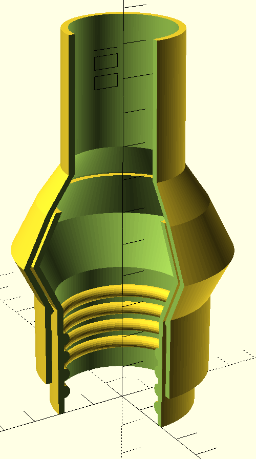

# vacuum-adapters

Workshop-vacuum-extraction-as-code (WVEaC). Generates 3D-printable
adapters to connect different things to a shop-vac. Like this one:

.

## Usage

You'll need to have `lein` and `OpenSCAD` installed.

Edit [configuration file](./src/vacuum_adapter/core.clj) and run `lein
run`. This will produce a bunch of OpenSCAD files.

For every defined connector you'll see the following files:
- Files with number in name (like `-0`) - those are additional parts to be printed separately (e.g. sealing rings).
- File with `-debug` in name contain all parts arranged in a line, with a cross-section cut out (like example above).
- File without any suffix is a primary part of a connector, to be printed in a single piece.
